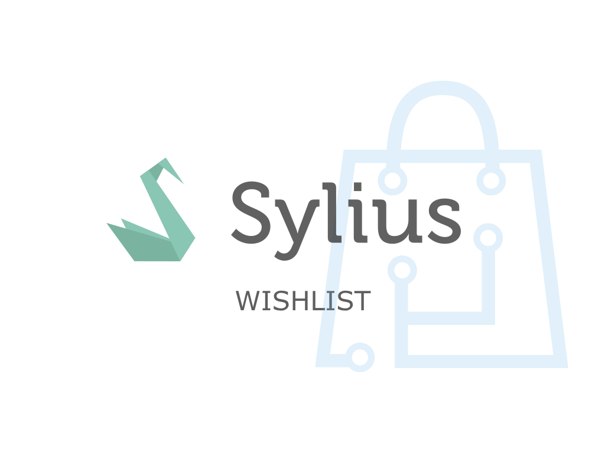
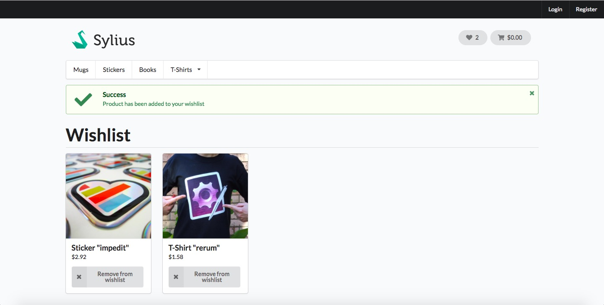

<h1 align="center">
    <a href="http://bitbag.shop" target="_blank">
        
    </a>
    <br />
    <a href="https://packagist.org/packages/bitbag/wishlist-plugin" title="License" target="_blank">
        
    </a>
    <a href="https://packagist.org/packages/bitbag/wishlist-plugin" title="Version" target="_blank">
        
    </a>
    <a href="http://travis-ci.org/BitBagCommerce/SyliusWishlistPlugin" title="Build status" target="_blank">
            
        </a>
    <a href="https://scrutinizer-ci.com/g/BitBagCommerce/SyliusWishlistPlugin/" title="Scrutinizer" target="_blank">
        
    </a>
    <a href="https://packagist.org/packages/bitbag/wishlist-plugin" title="Total Downloads" target="_blank">
        
    </a>
    <p>
        <a href="https://sylius.com/plugins/" target="_blank">
            
        </a>
    </p>
</h1>

## BitBag SyliusWishlistPlugin

This plugin allows you to integrate wishlist features with Sylius platform app.

## Support

We work on amazing eCommerce projects on top of Sylius and Pimcore. Need some help or additional resources for a project?
Write us an email on mikolaj.krol@bitbag.pl or visit [our website](https://bitbag.shop)! :rocket:

## Demo

We created a demo app with some useful use-cases of the plugin! Visit [demo.bitbag.shop](https://demo.bitbag.shop) to take a look at it. 
The admin can be accessed under [demo.bitbag.shop/admin](https://demo.bitbag.shop/admin) link and `sylius: sylius` credentials.

## Installation
```bash
$ composer require bitbag/wishlist-plugin
```
    
Add plugin dependencies to your `config/bundles.php` file:
```php
return [
    ...

    \BitBag\SyliusWishlisPlugin\BitBagSyliusWishlisPlugin => ['all' => true],
];
```

Import required config in your `config/packages/_sylius.yaml` file:
```yaml
# config/packages/_sylius.yaml

imports:
    ...
    
    - { resource: "@BitBagSyliusWishlisPlugin/Resources/config/config.yml" }
```

Update your database

```
$ bin/console doctrine:migrations:diff
$ bin/console doctrine:migrations:migrate
```

**Note:** If you are running it on production, add the `-e prod` flag to this command.

## Usage

### Rendering the wishlist

<div align="center">
    
</div>

You can  use `@BitBagSyliusWishlistPlugin/_addToWishlist.html.twig`, `@BitBagSyliusWishlistPlugin/_removeFromWishlist.html.twig` and `@BitBagSyliusWishlistPlugin/_removeFromWishlist.html.twig`
templates to enable adding/removing/displaying wishlist from the Twig UI.  

For an example on how to do that, take a look at [these source files](https://github.com/BitBagCommerce/SyliusWishlistPlugin/tree/master/tests/Application/templates/bundles/SyliusShopBundle).

## Customization

### Available services you can [decorate](https://symfony.com/doc/current/service_container/service_decoration.html) and forms you can [extend](http://symfony.com/doc/current/form/create_form_type_extension.html)

Run the below command to see what Symfony services are shared with this plugin:
```bash
$ bin/console debug:container | grep bitbag_sylius_wishlist_plugin
```

### Parameters you can override in your parameters.yml(.dist) file
```yml
$ bin/console debug:container --parameters | grep bitbag
```

## Testing
```bash
$ composer install
$ cd tests/Application
$ yarn install
$ yarn run gulp
$ bin/console assets:install public -e test
$ bin/console doctrine:schema:create -e test
$ bin/console server:run 127.0.0.1:8080 -d public -e test
$ open http://localhost:8080
$ vendor/bin/behat
$ vendor/bin/phpspec run
```

## Contribution

Learn more about our contribution workflow on http://docs.sylius.org/en/latest/contributing/.
