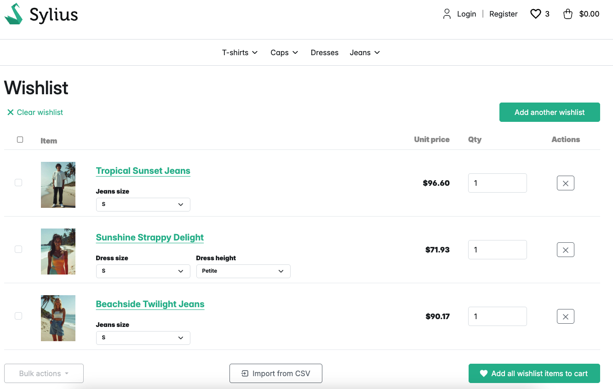

# SyliusWishlistPlugin

- [⬅️ Back](../README.md#overview)
- [➡️ Customization](./03-customization.md)

## Usage

    

You can use these templates to enable adding/removing/displaying wishlist:

- `@SyliusWishlistPlugin/common/add_to_wishlist.html.twig`
- `@SyliusWishlistPlugin/common/remove_from_wishlist.html.twig`
- `@SyliusWishlistPlugin/common/widget.html.twig`
