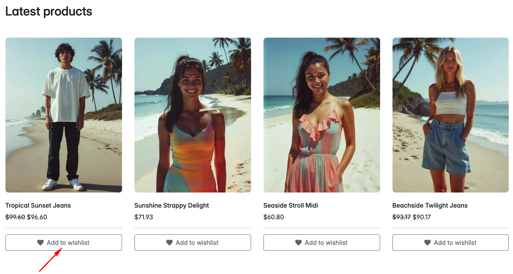
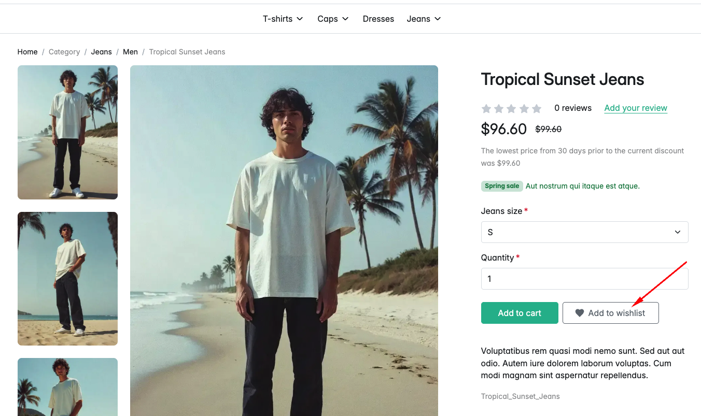
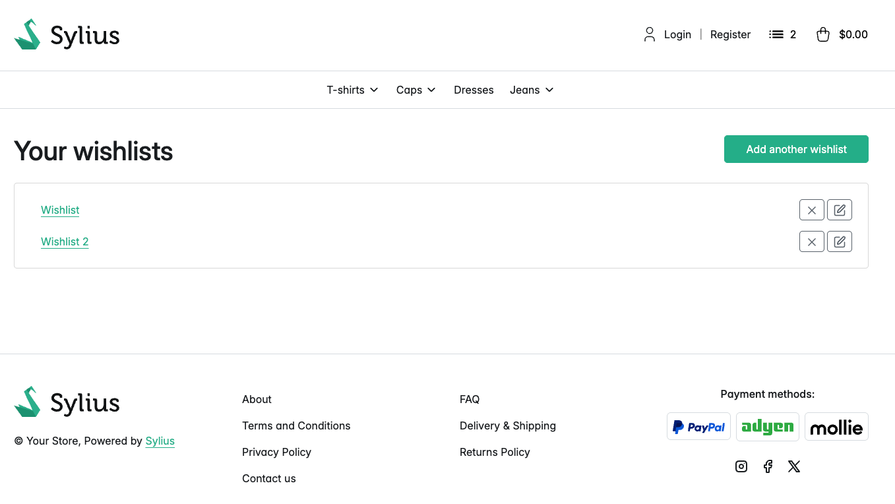

# Functionalities

---
**Adding product to the wishlist**

Many users want to save favorite products for later when they decide to buy then and not to forget about them until that moment. The Wishlist plugin gives users this opportunity by providing wishlists that will keep those chosen products.

Products can be added to the wishlist directly from the homepage, taxon product list or from the product page. Also, one product can be added to the same wishlist but with different options.

    

    

    

**Managing created wishlist**

User can access wishlists by clicking this button.

    

Once products are added to the wishlist user have a variety of actions to chose from while managing said wishlist.

    

- Adding all products from the wishlist to the cart,
- Removing one single product from the wishlist,
- Clearing whole wishlist,
- Importing products from CSV file to the wishlist,
- Adding checked products to the cart,
- Removing checked products to the cart.
- Exporting checked products to the CSV file.
- Exporting checked products to the PDF file.

**Managing multiple created wishlist**

It is possible for user to have more than one wishlist at the same time. If the user has only one wishlist, it is possible to create another directly from the view of the first wishlist. Se just has to click Add another wishlist button and choose a name for it.

    

Once the client has multiple wishlist, the "Your wishlists" page is available. 

    

When it comes to managing wishlists user can remove them, rename them or create another one.

